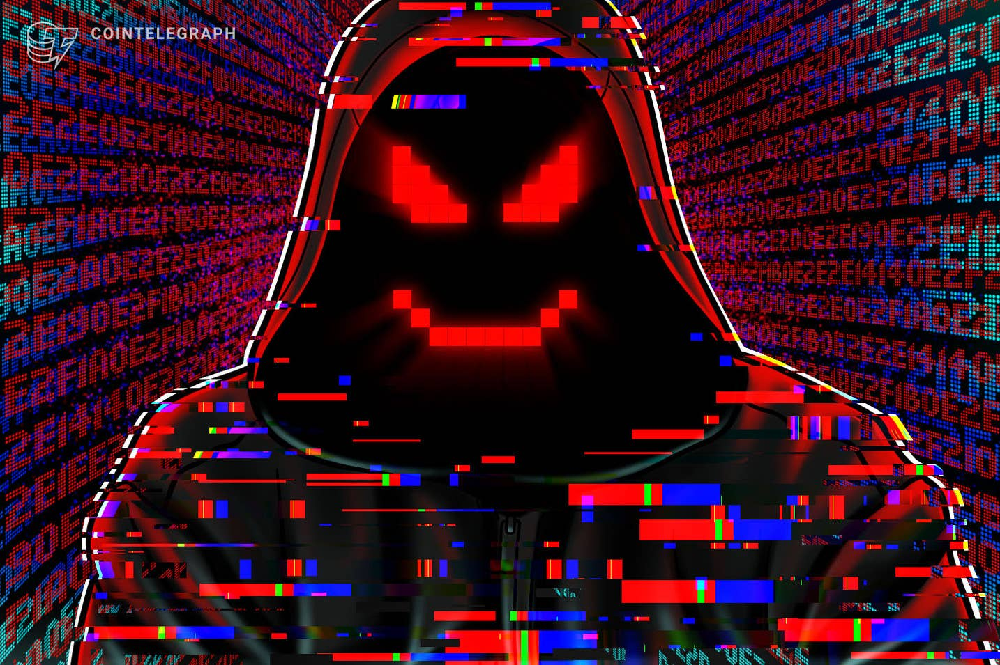

# 逆向实战之CTF比赛篇
## :sunglasses:简介

准备出一系列的CTF比赛中re题目的文章，作者水平有限，先从最简单的开始能出多少算多少把。
  

## 目录:file_folder:
- [Paper    【markdown格式的writeup】](Paper)
- [ctf    【ctf中逆向题目程序】](ctf)
- [poc 【ctf例子中的poc代码】](poc)

有兴趣的可以加群：一起讨论研究 `re`、`web`、`pwn`，游戏逆向分析等等技术

 

